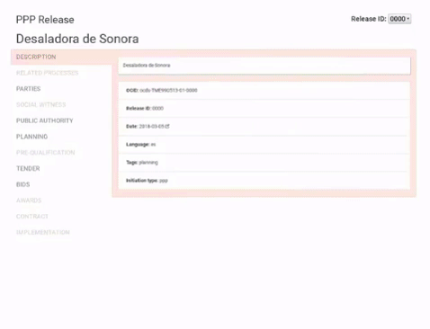

<h1>
  <h4>Este repositorio contiene los datos generados en relación al procedimiento de contratación abierta para el proyecto de la Desaladora de Sonora.</h4>
   
</h1>

<h4>Visualización de los datos:</h4>

<h1>
  <h4>Una colaboración de:</h4>
   
</h1>

  
  

